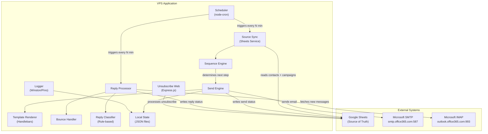

# Deaton Outreach Automation — Full Build Kit Plan

## 1. System Restatement

Deaton Outreach Automation is an unattended email outreach system running on a Linux VPS. It:

- Reads contacts and campaign definitions from **Google Sheets** (free tier, service account auth).
- Sends personalized multi-step email sequences through **Microsoft/GoDaddy SMTP** (`smtp.office365.com:587`).
- Processes inbound replies by reading from a **Microsoft mailbox via IMAP** (`outlook.office365.com:993`), either the sending inbox directly or a forwarding-destination inbox.
- Classifies replies into categories: qualified, not interested, unsubscribe, out of office, bounce, unclear.
- Honors unsubscribe requests via a **self-hosted HTTP endpoint** on the VPS and via reply keyword detection.
- Writes all status changes (send, bounce, reply, unsubscribe) back to Google Sheets.
- Maintains structured logs on disk for auditability.
- Runs on a schedule (cron-driven) without human intervention.

**Stack**: Node.js 20 LTS + TypeScript. Under 50 emails/day. Single sending address at MVP.

---

## 2. Assumptions

| #   | Assumption                                                                                                                                                                                                              |
| --- | ----------------------------------------------------------------------------------------------------------------------------------------------------------------------------------------------------------------------- |
| A1  | **Node.js 20 LTS + TypeScript** is the implementation language.                                                                                                                                                         |
| A2  | Email is **Microsoft 365 via GoDaddy**. SMTP host: `smtp.office365.com:587`. IMAP host: `outlook.office365.com:993`.                                                                                                    |
| A3  | User has **login credentials only** (email + password) for the sending address `dave@deatonengineering.us`. No GoDaddy admin access. No app registration possible.                                                      |
| A4  | **SMTP AUTH is confirmed enabled** on the tenant. Basic auth (username/password) works for SMTP sending. **IMAP availability is unknown** — Microsoft has been deprecating IMAP basic auth. Must be tested in Phase 0.  |
| A5  | Replies land in the `dave@deatonengineering.us` inbox. An Outlook forwarding rule copies them to `dknieriem@deatonengineering.com` for **human review only**. The system has **no credentials** for the `.com` address. |
| A5a | Reply processing uses a **tiered fallback**: (1) Try IMAP on sending mailbox, (2) Try EWS on sending mailbox, (3) Defer to manual human reply processing. See Section 3.                                                |
| A6  | Google Sheets via **service account** (free Google Cloud project, no billing required).                                                                                                                                 |
| A7  | Sending volume is **under 50 emails/day**. No IP warm-up or pool management needed.                                                                                                                                     |
| A8  | Sequences are **linear** (Step 1, Step 2, Step 3) — no branching logic at MVP.                                                                                                                                          |
| A9  | **No database at MVP** — Google Sheets is the source of truth, supplemented by local JSON state files for in-flight tracking.                                                                                           |
| A10 | Unsubscribe page is a **minimal Express.js HTTP endpoint** on the VPS, behind a reverse proxy (Caddy or nginx).                                                                                                         |
| A11 | Templates use **Handlebars** (Jinja2 equivalent for Node.js).                                                                                                                                                           |
| A12 | Reply classification uses **keyword/rule-based matching** — no ML at MVP.                                                                                                                                               |
| A13 | VPS runs **Ubuntu 22.04+** or Debian 12+.                                                                                                                                                                               |

---

## 3. Risks and Mitigations

### RESOLVED: SMTP Sending

SMTP AUTH is **confirmed enabled** on the GoDaddy/Microsoft 365 tenant. Sending via `smtp.office365.com:587` with username+password for `dave@deatonengineering.us` will work.

### KEY RISK: Inbox Reading for Reply Processing

Microsoft has been deprecating IMAP basic auth across Microsoft 365 tenants. SMTP AUTH being enabled does NOT guarantee IMAP works. The system can only attempt to read from the sending mailbox (`dave@deatonengineering.us`) — the forwarding destination (`dknieriem@deatonengineering.com`) is for human review only and we have no credentials for it.

**Tiered fallback plan (executed in Phase 0):**

- **Tier 1 — IMAP**: Test IMAP login to `outlook.office365.com:993` with the sending mailbox credentials. If it works, use `imapflow` (Node.js) to poll for new replies. This is the simplest and preferred path.
- **Tier 2 — EWS (Exchange Web Services)**: If IMAP fails, test EWS at `https://outlook.office365.com/EWS/Exchange.asmx` with the same credentials. EWS is deprecated but still functional on many M365 tenants. Node.js has the `ews-javascript-api` package.
- **Tier 3 — Manual reply processing (MVP-safe)**: If neither IMAP nor EWS works, defer automated reply processing. The human at `dknieriem@deatonengineering.com` reviews replies and manually updates the Google Sheet status column. The system still handles: sending, sequences, unsubscribe (via web endpoint), bounce detection (SMTP-level errors), and campaign tracking. Reply classification becomes a future phase.

**Tier 3 is a fully viable MVP.** The highest-value features (automated sending, sequence engine, unsubscribe compliance, tracking) all work without inbox reading.

### OTHER RISKS

- **Google Sheets rate limits**: 60 reads/min, 60 writes/min per service account. At <50 emails/day, this is fine. Mitigation: batch writes.
- **Microsoft 365 sending limits**: 10,000 recipients/day for M365. At <50/day, this is fine.
- **Reply forwarding adds latency**: If using forwarding instead of direct IMAP, there is a delay (seconds to minutes) before replies arrive in the destination mailbox.
- **Unsubscribe page availability**: If the VPS goes down, unsubscribe links break. Mitigation: health monitoring + the system also detects "unsubscribe" in reply text.

---

## 4. Build Kit Document List

### `/docs/` — Architecture and Design Documents

| File                        | Purpose                                                                           |
| --------------------------- | --------------------------------------------------------------------------------- |
| `SYSTEM_OVERVIEW.md`        | Plain-English system description, goals, constraints, component map               |
| `ARCHITECTURE.md`           | Technical architecture, module diagram, data flow, technology choices             |
| `WORKFLOWS.md`              | Step-by-step workflows for send, reply, bounce, unsubscribe, sequence advancement |
| `SECURITY.md`               | Threat model, credential handling, CAN-SPAM/GDPR compliance, network security     |
| `ENVIRONMENT_VARIABLES.md`  | Every env var with name, type, required/optional, description, example            |
| `DATA_MODEL.md`             | Google Sheets schema (all tabs, columns, types), local state file schemas         |
| `DEPLOYMENT.md`             | VPS setup, Node.js install, process management, reverse proxy, TLS, domain        |
| `OPERATIONS.md`             | Runbook: starting/stopping, manual overrides, common troubleshooting              |
| `LOGGING_AND_MONITORING.md` | Log format, log rotation, health checks, alerting strategy                        |
| `FAILURE_MODES.md`          | Every failure scenario, detection method, recovery procedure                      |
| `ADR_GUIDELINES.md`         | Architecture Decision Record template and index                                   |

### `/specs/` — Component Specifications

| File                    | Purpose                                                                  |
| ----------------------- | ------------------------------------------------------------------------ |
| `SEND_ENGINE.md`        | SMTP connection, rate limiting, personalization, error handling          |
| `REPLY_PROCESSOR.md`    | IMAP polling, reply parsing, classification rules, forwarding workflow   |
| `UNSUBSCRIBE_SYSTEM.md` | HTTP endpoint, link generation, reply-based detection, Sheets update     |
| `BOUNCE_HANDLER.md`     | Bounce detection via SMTP errors and IMAP NDR parsing                    |
| `SEQUENCE_ENGINE.md`    | Multi-step sequence logic, timing, step advancement, skip/halt rules     |
| `SOURCE_SYNC.md`        | Google Sheets read/write, batching, conflict handling, schema validation |

### `/project/` — Project Meta Files

| File              | Purpose                                             |
| ----------------- | --------------------------------------------------- |
| `README.md`       | Quick start, prerequisites, setup, run instructions |
| `CHANGELOG.md`    | Version history (starts empty with template)        |
| `CONTRIBUTING.md` | Dev workflow, code style, PR process                |

### `/cursor/` — Cursor Build Instructions

| File                      | Purpose                                                                                    |
| ------------------------- | ------------------------------------------------------------------------------------------ |
| `BUILD_PLAN.md`           | Ordered build phases with entry/exit criteria                                              |
| `TASKS.md`                | Granular task breakdown for each build phase                                               |
| `IMPLEMENTATION_GUIDE.md` | Cursor-specific instructions: how to read the docs, which order to build, testing protocol |

**Total: 22 documents.**

---

## 5. Project Folder Structure (Implementation Target)

This is the folder structure the **built application** will use. The build kit documents describe how to build this.

```
deaton-outreach/
├── docs/                          # Architecture docs (generated by this build kit)
│   ├── SYSTEM_OVERVIEW.md
│   ├── ARCHITECTURE.md
│   ├── WORKFLOWS.md
│   ├── SECURITY.md
│   ├── ENVIRONMENT_VARIABLES.md
│   ├── DATA_MODEL.md
│   ├── DEPLOYMENT.md
│   ├── OPERATIONS.md
│   ├── LOGGING_AND_MONITORING.md
│   ├── FAILURE_MODES.md
│   └── ADR_GUIDELINES.md
├── specs/                         # Component specs
│   ├── SEND_ENGINE.md
│   ├── REPLY_PROCESSOR.md
│   ├── UNSUBSCRIBE_SYSTEM.md
│   ├── BOUNCE_HANDLER.md
│   ├── SEQUENCE_ENGINE.md
│   └── SOURCE_SYNC.md
├── cursor/                        # Cursor build instructions
│   ├── BUILD_PLAN.md
│   ├── TASKS.md
│   └── IMPLEMENTATION_GUIDE.md
├── src/                           # Application source code
│   ├── config/                    # Configuration loading + validation
│   │   ├── index.ts               # Loads and validates all config from env
│   │   └── schema.ts              # Zod schemas for config validation
│   ├── services/                  # External service integrations
│   │   ├── smtp.ts                # SMTP connection + send via Nodemailer
│   │   ├── imap.ts                # IMAP connection + message fetching
│   │   └── sheets.ts              # Google Sheets API read/write
│   ├── engine/                    # Core business logic
│   │   ├── send-engine.ts         # Orchestrates sending for a campaign run
│   │   ├── sequence-engine.ts     # Multi-step sequence state machine
│   │   ├── reply-processor.ts     # IMAP poll + classify + route replies
│   │   ├── bounce-handler.ts      # Bounce detection and recording
│   │   └── unsubscribe.ts         # Unsubscribe link generation + processing
│   ├── templates/                 # Handlebars email templates
│   │   └── (campaign templates)
│   ├── classifiers/               # Reply classification rules
│   │   └── reply-rules.ts         # Keyword/pattern-based classifier
│   ├── web/                       # Unsubscribe HTTP endpoint
│   │   ├── server.ts              # Express app setup
│   │   └── routes/
│   │       └── unsubscribe.ts     # GET /unsubscribe?token=...
│   ├── state/                     # Local state management
│   │   └── local-store.ts         # JSON file read/write for in-flight state
│   ├── logging/                   # Logging configuration
│   │   └── logger.ts              # Winston/Pino setup
│   ├── scheduler/                 # Job scheduling
│   │   └── cron.ts                # node-cron job definitions
│   ├── utils/                     # Shared utilities
│   │   ├── crypto.ts              # Token generation for unsubscribe links
│   │   └── rate-limiter.ts        # Simple token-bucket rate limiter
│   └── main.ts                    # Entry point: starts scheduler + web server
├── data/                          # Runtime data (gitignored)
│   ├── state/                     # JSON state files
│   └── logs/                      # Application logs
├── templates/                     # Email template files (.hbs)
├── .env.example                   # Environment variable template
├── .gitignore
├── package.json
├── tsconfig.json
├── README.md
├── CHANGELOG.md
└── CONTRIBUTING.md
```

### Key Design Decisions in the Structure

- `**src/services/**` isolates all external I/O (SMTP, IMAP, Sheets). Every service exposes a clean interface. This makes testing and swapping implementations easy.
- `**src/engine/**` contains pure business logic that calls services. No direct I/O in engine files.
- `**src/web/**` is the unsubscribe HTTP server — a separate concern from the email engine.
- `**src/state/**` manages local JSON files for tracking in-flight sends (protects against crashes mid-run).
- `**data/**` is gitignored — runtime state and logs live here.
- Templates are outside `src/` so they can be edited without touching code.

---

## 6. Architecture Overview



### Data Flow Summary

1. **Scheduler** fires on a cron interval (e.g., every 5 minutes).
2. **Source Sync** reads contacts and campaign config from Google Sheets.
3. **Sequence Engine** determines which contacts need which step sent next (based on timing and status).
4. **Send Engine** renders templates, sends via SMTP, records status in Sheets + local state.
5. **Reply Processor** polls IMAP for new messages, classifies them, updates Sheets.
6. **Unsubscribe Web** listens for HTTP GET requests on unsubscribe links, updates Sheets.

---

## 7. Google Sheets Setup (Free, No Cost)

The user sets up Google Sheets API access as follows:

1. Go to [Google Cloud Console](https://console.cloud.google.com/).
2. Create a new project (free).
3. Enable the **Google Sheets API** (free, no billing required).
4. Go to **IAM and Admin > Service Accounts** — create a service account.
5. Create a JSON key for the service account — download it.
6. Create the tracking spreadsheet in Google Sheets.
7. Share the spreadsheet with the service account email (e.g., `deaton-bot@project-id.iam.gserviceaccount.com`) as **Editor**.
8. Place the JSON key file on the VPS (path referenced in `.env`).

**Cost: $0.** The Sheets API free tier allows 300 requests/minute, far exceeding the needs of <50 emails/day.

---

## 8. Build Phases

### Phase 0: Validate Credentials (3 tasks)

- Test SMTP send to a test address from `dave@deatonengineering.us` (SMTP AUTH confirmed enabled — expect success).
- Test IMAP connect to `outlook.office365.com:993` with the same credentials. If it works → Tier 1 (full reply processing). If it fails → continue.
- Test EWS connect to `outlook.office365.com/EWS/Exchange.asmx` with the same credentials. If it works → Tier 2. If it fails → Tier 3 (manual reply processing at MVP).

### Phase 1: Foundation (5 tasks)

- Project scaffolding (package.json, tsconfig, eslint, .env)
- Config module with Zod validation
- Logger setup
- Google Sheets service (read/write)
- Local state store (JSON files)

### Phase 2: Send Pipeline (5 tasks)

- SMTP service (Nodemailer)
- Template renderer (Handlebars)
- Send engine (orchestration)
- Sequence engine (multi-step logic)
- Source sync (Sheets to send engine)

### Phase 3: Inbound Processing (conditional — depends on Phase 0 results)

**If Tier 1 (IMAP) or Tier 2 (EWS) succeeded (4 tasks):**

- IMAP or EWS inbox reading service
- Reply processor + keyword classifier
- Bounce handler (IMAP NDR parsing)
- Sheets status update for replies/bounces

**If Tier 3 (manual) — skip automated reply processing (1 task):**

- Add a "Reply Status" column to Google Sheets for the human at `dknieriem@deatonengineering.com` to update manually
- Document the manual workflow in OPERATIONS.md
- Bounce detection is still automated at SMTP send time (error codes)

### Phase 4: Unsubscribe System (3 tasks)

- Token generation + link embedding
- Express.js unsubscribe endpoint
- Reply-based unsubscribe detection

### Phase 5: Scheduling and Integration (2 tasks)

- Cron scheduler wiring
- End-to-end integration testing

### Phase 6: Deployment (3 tasks)

- VPS setup (Node.js, PM2, Caddy)
- TLS + domain for unsubscribe endpoint
- Monitoring + log rotation

**Total: 20–24 tasks across 7 phases (depending on Phase 0 inbox access results).**
